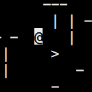

# OCaml Roguelike Demo

This is a toy example of a terminal application with roguelike-style level generation and movement in OCaml. While I cannot necessarily endorse it as a pinnacle of good design, some may still find it useful.

This works on Unix systems and requires no dependencies other than `ocamlc` and `unix.cma`. You can use `./build.sh` to generate an executable in the directory `build/main`.
